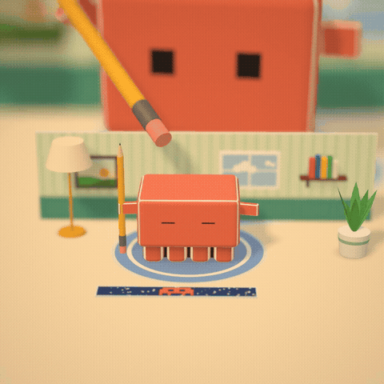
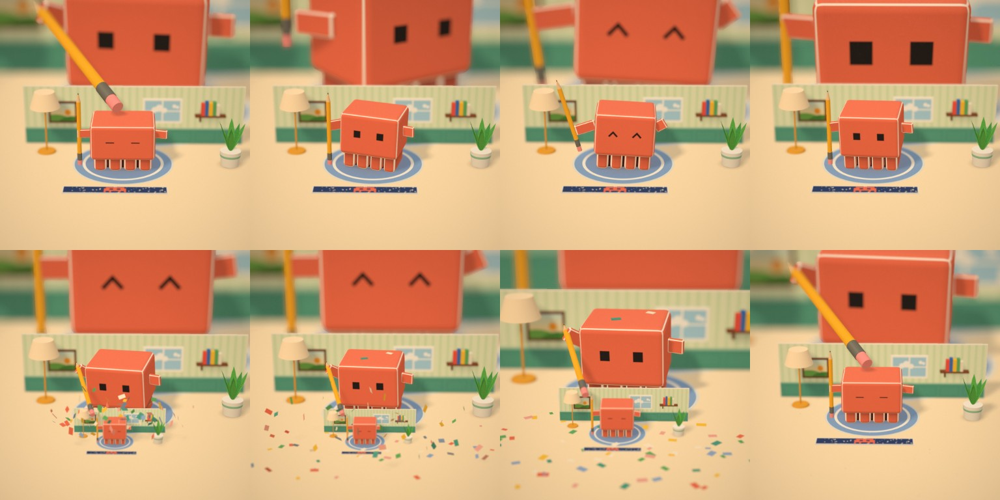

# 📦 PAPER DROSTE — бесконечный бумажный робот

**Бумажный робот-коробка стукает карандашом по голове себя поменьше, и так бесконечно. Ни одного кадра из Blender: вся сцена, свет и анимация — код на three.js.**



<p align="center">автор — Андрей Овчаренко · <a href="https://t.me/Amovcharenko">tg @Amovcharenko</a> · <b><a href="https://t.me/andreydraft">📣 канал @andreydraft</a></b></p>

---

## 💡 Идея

В чате скинули гифку из твиттера: бумажный робот в игрушечной комнате, сзади его огромная копия, спереди — крошечная, камера бесконечно наезжает. Автор оригинала собирался «ставить Blender и смотреть, как такое рендерить». Захотелось повторить её 1 в 1 прямо в браузере.



## 🎨 Визуал

- [three.js](https://threejs.org), один файл [`index.html`](index.html), без моделей и картинок: все текстуры — бумага с волокнами, полоски обоев, окно с облаками, картина, карточка с пиксельным роботом — рисуются на canvas при запуске
- Робот — скруглённые коробки с белыми кромками сгибов, лапки-пластинки, ножки в тени корпуса
- Мягкие тени (VSM), контактные тени под предметами, тёплая «бумажная» цветокоррекция
- Глубина резкости — свой шейдер: дальний план размыт сильно, передний остаётся резким, как у макросъёмки
- Раскрытие мини-диорамы — как в книжке-раскладушке: стенка поднимается с перелётом, конфетти летит с сопротивлением воздуха

## 🚧 Самое трудное

**Бесшовный бесконечный зум.** Мир самоподобный: каждый следующий уровень — та же диорама, уменьшенная в `K` раз вокруг одной неподвижной точки на столе, и робот на нём живёт по тому же таймлайну, сдвинутому на один период. Камера, свет, рамка теней и фокус масштабируются вместе с миром, поэтому последний кадр лупа совпадает с первым до пикселя — склейки нет.

**Движение.** Тайминги снимались с оригинала покадрово, через каждые 0.2 с: когда робот просыпается, подпрыгивает, оглядывается, машет карандашом, когда большой робот отворачивается и подаётся вперёд, когда малыш выскакивает из карточки. Чтобы карандаш всегда был «в лапке», лапка каждый кадр поворачивается и тянется к ближайшей точке карандаша.

## Что внутри

| Путь | Что это |
|---|---|
| [`index.html`](index.html) | Вся сцена: текстуры, диорама, робот, хореография, пост-обработка; `window.frame(t)` рисует кадр в момент `t` |
| [`render.mjs`](render.mjs) | Рендер кадров в headless Chrome и сборка MP4 через ffmpeg |
| [`docs/`](docs/) | Луп в MP4 и GIF, постер, лист кадров |

## Рендер

Нужны Node.js, Google Chrome и ffmpeg.

```bash
npm install
python3 -m http.server 8000            # и открыть http://localhost:8000 — сцена рисует кадр t=0
node render.mjs --sheet                # лист из 8 кадров в out/sheet.jpg
node render.mjs                        # бесшовный луп 6 с, 1024×1024, 25 fps в out/paper-droste.mp4
node render.mjs --loops=3              # луп три раза подряд
```

Chrome не в стандартном месте — `CHROME=/путь/к/chrome node render.mjs`.

---

⭐ Понравилось — поставь звезду репе, это лучший способ сказать спасибо. Больше таких экспериментов — в телеграм-канале **[@andreydraft](https://t.me/andreydraft)**.
